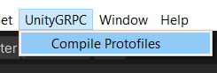

# UnityGRPC

Library and tools for using [Protobuf](https://developers.google.com/protocol-buffers) and [GRPC](https://grpc.io/) with unity. Currently only tested with Windows, but runtimes are included for MacOS, Linux, Android and IOS.

## Setup

 - [install .Net Core / .Net 5.0](https://dotnet.microsoft.com/download)
 - Use the Unity Package Manager -> `+` -> `add package from git UTL`-> `git@github.com:donnerlab1/UnityGRPC.git` (this might take some time as it needs to download the grpc runtimes)
 - If you want to look at the samples, either clone this repo and add it to your Project or go the the [releases](https://github.com/donnerlab1/UnityGRPC/releases) page and download the latest assetbundle

## Usage
- Create protofiles

- Fill them with your (protobuf messages)[https://developers.google.com/protocol-buffers/docs/proto3] and (grpc services)[https://www.grpc.io/docs/languages/csharp/basics/]
- Unity Toolbar -> UnityGRPC -> Compile protos

- You are now able to use the generated client and server code
  
